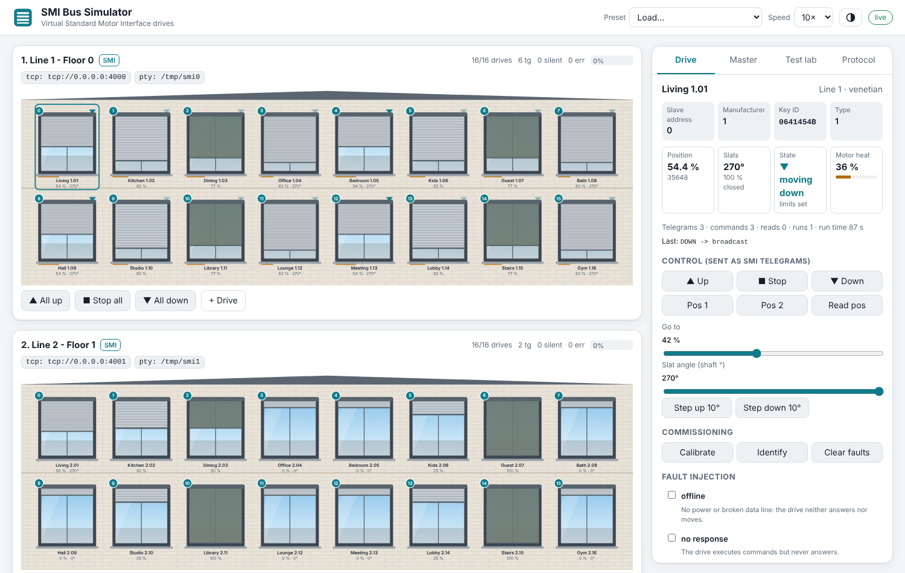
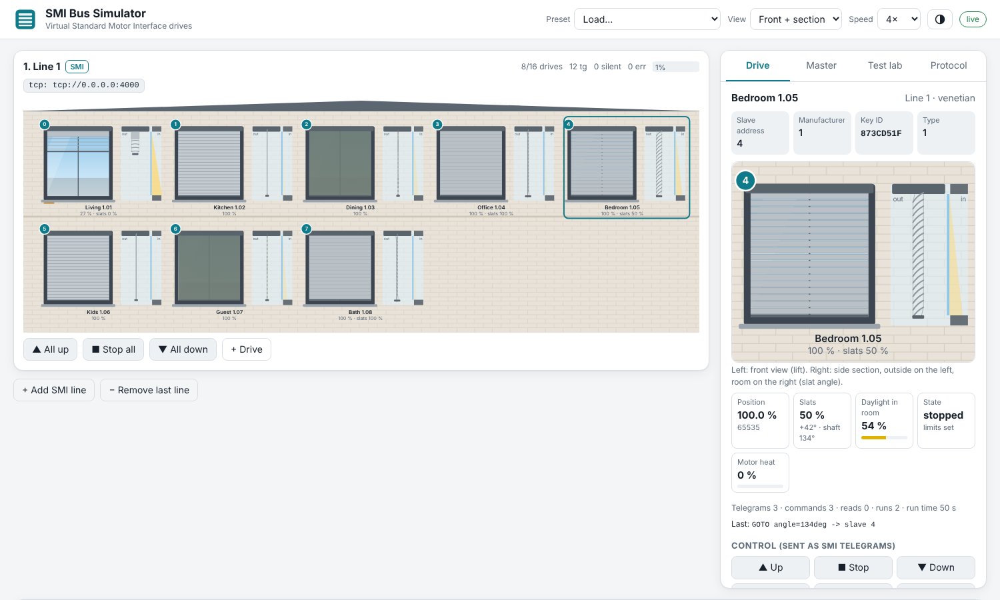

# SMI Bus Simulator

**Virtual SMI (Standard Motor Interface) drives for sunblinds, venetian blinds, roller
shutters, screens and awnings, with a live building visualization.**

Connect your SMI controller (a PC, a Raspberry Pi or other ARM board, a PLC, a
microcontroller, a Docker container) to the simulator. The simulator answers like a line
of real SMI drives: they move, tilt their slats, report positions, trip their thermal
protection and lose their end positions. You watch it all happen on a virtual facade.



> Open source under Apache-2.0. Not affiliated with or endorsed by SMI Standard Motor
> Interface e.V. "SMI" is used only to describe the protocol. The official specification is
> members-only, so this project is built from public sources, with every assumption
> marked. See [docs/protocol.md](docs/protocol.md).



## Features

* **SMI wire protocol at 2400 8N1.** Address byte with slave and manufacturer addressing,
  group masks, broadcast, slave-ID addressing, drive commands (up, down, stop, Pos1/Pos2,
  go to position, angle steps), position queries, diagnosis flags, ACK/NACK and
  two's-complement checksums. Checked against published bus captures.
* **Realistic drives.** Travel times, slower upward travel, venetian slat turning before
  travel, angle steps in 2° units, a reversal dead time, stored intermediate positions,
  thermal protection (S2 duty cycle), obstacle detection, end-position calibration.
* **Lift and tilt, seen separately.** Switch the facade to *Front + section*: each window
  shows the front view (how far the blind is down) next to a side section (the real slat
  angle, the roll diameter or the awning reach, and how much daylight reaches the room).
  Slat position follows the KNX convention: 0 % open, 100 % closed.
* **A real bus.** Up to 16 drives per line, as many lines as you like (16, 32, 64, …).
  Simultaneous answers combine as a wired-AND, so duplicate addresses really do garble
  reads.
* **Connect any way.** A raw TCP socket per line, a virtual serial port (`/tmp/smi0`),
  a physical serial port (a USB-UART adapter), or shared-bus mode next to real drives
  on a real line.
* **Live web UI.** An animated building facade, drive details, a fault-injection panel, a
  built-in SMI master with a telegram builder, a bus monitor with decoded telegrams and CSV
  export, plus light and dark themes. It works on a phone.
* **Commissioning.** Factory-new drives on address 0, and a reference slave-ID discovery
  and addressing routine you can watch telegram by telegram.
* **Controller test lab.** Checks coverage, group use, diagnosis, retries after lost or
  corrupt answers, behaviour with offline drives, fault detection and bus load. Exports a
  JSON report.
* **Built for automation.** HTTP/WebSocket API, a Python master library, a CLI and a
  Docker image.

## Quick start

```bash
pip install git+https://github.com/codesmithbob/smi-bus-simulator
smisim run --buses 2 --motors 16 --pty /tmp/smi
```

Open <http://localhost:8080>. Line 1 is on `tcp://localhost:4000` and `/tmp/smi0`, line 2
on `tcp://localhost:4001` and `/tmp/smi1`.

With Docker:

```bash
git clone https://github.com/codesmithbob/smi-bus-simulator && cd smi-bus-simulator
docker compose up            # uses examples/two-floors.toml
```

Send a few telegrams with the bundled master:

```bash
smisim send --tcp localhost:4000 -a 3 down          # 53 02 AB  -> FF (ACK)
smisim send --tcp localhost:4000 -a 3 position      # 73 05 88  -> EF 45 hh ll ck
smisim send --tcp localhost:4000 -g 0,1,2 goto 50%  # group telegram
smisim send --serial /tmp/smi0 -b diag              # broadcast diagnosis
smisim send --tcp localhost:4000 discover           # address factory-new drives
smisim decode 43 C0 80 03 01 79                     # explain any telegram
```

Or embed the drives in your own program or test suite, with no server and no asyncio (the
[stable Python API](docs/api.md#python-in-process-api-stable)):

```python
from smisim import Bus, BusSettings, MotorConfig

bus = Bus(settings=BusSettings(name="Lab line"))
bus.add_motor(MotorConfig(address=3, kind="venetian"))
reply, delay = bus.handle_frame(bytes.fromhex("53 02 AB"))  # DOWN to slave 3 -> ACK
bus.update(1.0)  # one simulated second
```

Or talk to a running simulator from Python:

```python
from smisim.client import SmiMaster, TcpLink
from smisim.protocol import Addressing, Command

async with SmiMaster(TcpLink("localhost", 4000)) as smi:
    await smi.command(Addressing.to_slaves([0, 2, 4]), Command.GOTO, position=0x8000)
    print(await smi.read_position(2))
```

### Simulation speed

Drives move in real time by default. To watch long runs faster, raise `time_scale`
(simulated seconds per real second, 0.1 to 50): `smisim run --time-scale 10`,
`time_scale = 10` under `[simulator]` in a config file, the *Speed* list in the web UI, or
`POST /api/settings` with `{"time_scale": 10}`. It speeds up the drives only; telegram
timing on the wire stays at 2400 baud. Details:
[configuration.md](docs/configuration.md#simulation-speed-time_scale).

## Who is it for?

* **Controller and gateway developers** (KNX, BACnet, Modbus, Matter, Home Assistant,
  openHAB, PLC programs) who need 16, 32 or 64 drives on the desk without a test wall.
* **Teams preparing for SMI certification** who want to pre-test commissioning, polling,
  retries and fault handling at full line size. The [test lab](docs/testing-controllers.md)
  is an unofficial pre-check, not the certification itself.
* **Integrators and trainers** who want to show how SMI addressing, groups and
  diagnosis work.
* **CI pipelines**: run the Docker image as a service and test your driver on every commit.

## Documentation

| Document | Content |
|---|---|
| [docs/protocol.md](docs/protocol.md) | What is known about the SMI wire format, with sources and status |
| [docs/hardware.md](docs/hardware.md) | TCP, PTY, USB-serial and shared real bus, plus Docker and safety notes |
| [docs/testing-controllers.md](docs/testing-controllers.md) | Sizing, commissioning, calibration, test lab, fault reference |
| [docs/configuration.md](docs/configuration.md) | TOML configuration reference |
| [docs/api.md](docs/api.md) | Stable Python in-process API (embed drives without the server), HTTP and WebSocket API |
| [CONTRIBUTING.md](CONTRIBUTING.md) | Development setup, architecture, how to propose protocol fixes |

## Architecture

```
src/smisim/
  protocol/   constants (with verification status), telegram codec, stream framing
  motor.py    drive model: kinematics, venetian tilt, thermal, faults, SMI answers
  bus.py      one SMI line: addressing, wired-AND answers, traffic log, statistics
  transports/ TCP, PTY and serial links (all share the same framing and timing)
  simulator.py lines + transports + motion clock + presets + built-in master
  testlab.py  controller pre-check
  client.py   master library (also used by the CLI and the discovery routine)
  web/        aiohttp server and the dependency-free static UI
```

## Status and limits

This is an early release (0.1). The basic command set is based on observed captures.
Discovery, address writing, extended queries and the SMI 3.0 D14 properties use
**provisional** encodings until someone with access to the specification confirms or
corrects them. Each one is marked in the UI, in the monitor and in
[docs/protocol.md](docs/protocol.md). Corrections are very welcome.

## License

[Apache License 2.0](LICENSE).
